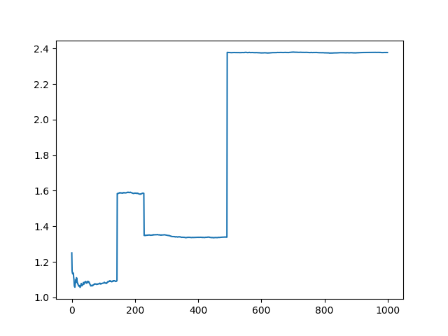
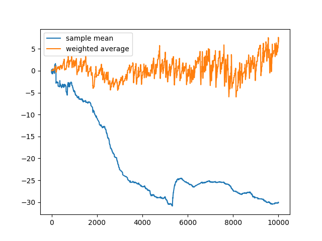
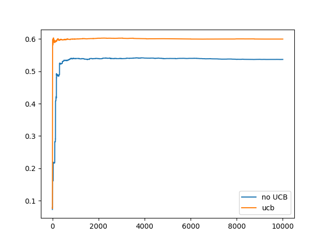

<style TYPE="text/css">
code.has-jax {font: inherit; font-size: 100%; background: inherit; border: inherit;}
</style>
<script type="text/x-mathjax-config">
MathJax.Hub.Config({
    tex2jax: {
        inlineMath: [['$','$'], ['\\(','\\)']],
        skipTags: ['script', 'noscript', 'style', 'textarea', 'pre'] // removed 'code' entry
    }
});
MathJax.Hub.Queue(function() {
    var all = MathJax.Hub.getAllJax(), i;
    for(i = 0; i < all.length; i += 1) {
        all[i].SourceElement().parentNode.className += ' has-jax';
    }
});
</script>
<script type="text/javascript" src="https://cdnjs.cloudflare.com/ajax/libs/mathjax/2.7.4/MathJax.js?config=TeX-AMS_HTML-full"></script>


# Chapter 2
# Week 1 Notes

## A $k$-Armed Bandit Problem 
- TLDR of the problem is you have $k$ options each with a reward that follows a probability distribution
- Actual reward given an action $ a $ is $ q_*(a) = E[R_t|A_t = a]$
  - reward is how your *machine* evaluates its performance, the analogy was $k$ slot machines, where pulling the levers on each has a different probability of success, similarly for every action $ a $ there is a corresponding reward $R_t$
  - $t$ is a time step
- $ q_*(a) $ is the actual value, which of course can't be known (if it was one can just pick the largest rewarding path everytime), thus its estimated with $Q_t(a)$
- Action with highest reward is called *greedy* action
  - selecting this action means you are *exploiting* current action
  - not taking the greedy action means you are *exploring* current action
  - sometimes its better to explore since it may lead to larger rewards later due to the uncertainty of the rewards for some actions

## Action-Value Methods

- Action-Value Methods estimate reward for an action
- Since the actual value is an expectation (a.k.a. a mean), makes sense to calculate the estimate as an average
  - $ Q_t(a) = \dfrac{\sum\limits_{i=1}^{t-1} R_i \cdot I_{A_i = a} }{\sum\limits_{i=1}^{t-1} I_{A_i = a} }$
  - $I_{A_i = a}$ is an indicator variable that at time step $i$ action $a$ was taken
    - a refresher on indicator variables (below example is for an arbitrary event $e$)
      - $I_{e} = \begin{cases} 1, \text{if e}\\ 0, \text{if not e}\end{cases}$
  - Special considerations need to be made for the case that the denominator is zero (action $a$ is never taken), for example, if denominator is zero set reward to 0
  - Strong Law of Large Numbers: $ \bar{X}_n \rightarrow \mu $ as $n \rightarrow \infty$
    - Since our estimate $Q_t(a)$ is indeed a sample mean of rewards, we know that as the number of $a$ increases, $Q_t(a) \rightarrow q_*(a)$
- if we want to maximize $Q_t(a)$ (i.e choose the *greedy* action) then of course our $A_t$ would be:
    - let the space of all actions be $\Omega$
    - $A_t := \{a | Q_t(\alpha) \leq Q_t(a) \forall \alpha\in\Omega\}$
    - Special considerations need to be made in the case that there are multiple $A_t$ since you can't pick more than one action, an example could be to just pick one at random (since the reward is the same anyways)
- As mentioned before, going greedy all day isnt always the best, thus sometimes its good, with a small probability $\epsilon$ to choose a non-greedy path, this is known as a $\epsilon$-greedy method
- *Exercise 2.1:* in $\epsilon$-greedy action selection, for the case of two actions and $\epsilon=0.5$, what is the probability that the greedy action is selected?
  - The probability that the greedy action is selected is $1 - \epsilon = 0.5$

## The 10-Armed Testbed
- *Exercise 2.2: Bandit Example* Consider a k-armed bandit probem with $k=4$ actions. Consider applying  a bandit algorithm using $\epsilon$-greedy action selection, sample-average estimates, and initial estiare of $Q_1=0 \: \forall a$. Further suppose the following action sequence (table of values below):
  - On some of the above an $\epsilon$ case may have occurred, causing an action to be selected at random. On which time step did this definitely occur? On which steps could this possibly have occurred?
  - On time step 5 it definitely performed a epsilon step since after getting the hightest average rewards on action 2, it went to action 3 which would not have been the greedy choice. An epsilon step could have potentially occurred on step 1, since it was the first step and there was still an $\epsilon$ chance that was the one that was chosen

| t | A | R |
| --- | --- | --- |
| 1 | 1 | -1 |
| 2 | 2 | 1  |
| 3 | 2 | -2 |
| 4 | 2 | 2  |
| 5 | 3 | 0  |


- *Exercise 2.3* In the comparison showin in Figure 2.2, which method will perform best in the long run in terms of cumulative reward and probability of selecting the best action? How much better will it be? Express your answer quantitatively.
  - $\epsilon = 0.01$ will perform better over time, as its approaching 1.55 faster than $\epsilon = 0.1$, furthermore, since it is more greedy, it will pick the optimal action $99\%$ of the time since eventually with $\epsilon = 0.01$ it will find the action with highest reward and greedily remain with it thus increasing the optimal action to $99\%$

## Incremental Implementation

- calculating action value over $n-1$ selections can be extremely computationaly expensive as $n$ grows, so intead use the following to compute average as an action is selected:
  - Given that $Q_n = \dfrac{R_1 + R_2 + \dots + R_{n-1}}{n-1}$
  - $Q_{n+1} = Q_n + \dfrac{1}{n}\left[R_n - Q_n\right]$
  - The above is a form that occurs frequently to save compuation time:
    - $New \: Estimate \leftarrow Old \: Estimate \; + \; Step \: Size \left[Target \; - \; Old \: Estimate\right] $
    - $Target \; - \; Old \: Estimate$ can be viewed as error
    - $Step \: Size$ is denoted as $\alpha$ or $\alpha_t(a)$
- Simple bandit algorithm pseudocode
```
Initialize, for a = 1 to k:
  Q(a) <- 0
  N(a) <- 0

Loop Forever:
  A <-  { Argmax_a Q(a)     with probability 1 - e
        { a random action   With probability e
  R <- bandit(A)
  N(A) <- N(A) + 1
  Q(A) <- Q(A) + (1/N(A))*(R - Q(A))
```
- Implemented the above in python (simple_bandit.py) and this was the result with $\epsilon = 0.01$:
  - 
  
## Tracking a Nonstationary Problem

- For non stationary problems, we want to count older rewards as less important, hence a weighted average is a better way to calculate reward
- Thus our new reward calculation is:
  - Given that $Q_{n+1} = Q_n + \alpha \left[R_n - Q_n\right]$
  - $Q_{n+1} = (1 - \alpha)^nQ_1 + \sum\limits_{i=1}^n\alpha(1-\alpha)^{n-i}R_i$
  - This is a weighted average since $(1 - \alpha)^n + \sum\limits_{i=1}^n\alpha(1-\alpha)^{n-i} = 1$
    - Proof (was left as an exercise to the reader in the book as usual lol):
    - First let $\alpha \in (0, 1]$ and $\gamma := (1-\alpha)$
    - $\gamma \neq 1$ Since if $\gamma = 1$ then $\alpha = 0$ which won't fit the supposition of $\alpha \in (0,1]$
$$
\begin{align*}
(1-\alpha)^n + \sum\limits_{i=1}^n\alpha(1-\alpha)^{n-i} &= \gamma^n + \sum\limits_{i=1}^n\alpha\gamma^{n-i}\\
&= \gamma^n + \sum\limits_{k=0}^{n-1}\alpha\gamma^{k} \\
&= \gamma^n + \alpha\left(\dfrac{1-\gamma^n}{1-\gamma}\right)\text{\qquad By geometric sum for $\gamma \neq 1$}\\
&= (1 - \alpha)^n + \alpha\left(\dfrac{1 - (1 - \alpha)^n}{1 - (1 - \alpha)}\right)\\
&= (1 - \alpha)^n + 1 - (1 - \alpha)^n\\
&= 1
\end{align*}
$$
  - This reward calculation is called *exponential recency-weighted average*
- Constant step size $\alpha_n(a) = \alpha$ does not converge, however this is infact desireable in a non stationary situation
- *Exercise 2.4* If the step-size parameters, $alpha_n$, are not constant, then the estimate $Q_n$ is a weighted average of previously received rewards with a weighting different from that given by (2.6). What is the weighting on each prior reward for the general case, analogous to (2.6), in terms of the sequence of step-size parameters?
  - Could not find a solution myself, however there is one [here](https://github.com/JKCooper2/rlai-exercises/blob/master/Chapter%202/Exercise%202.2.md)
- *Excersie 2.4* Design and conduct an experiment to demonstrate the difficulties that sample-average methods have for non-stationary problems. Use a modified version of the 10-armed testbed in which all the q*(a) start out equal and then take independent random walks. Prepare plots like Figure 2.2 for an action-value method using sample averages, incrementally computed by alpha = 1/n, and another action-value method using a constant step-size parameter, alpha = 0.1. Use epsilon = 0.1 and, if necessary, runs longer than 1000 plays.
  - Check simple_bandit.py for the code (NonstationaryMachine object)
    - One change I made from the textbook was I increased the variance in the reward change (from 0.01 to 1), since it wasn't high enough to show that the new weighted reward was better (infact sample average performed better since the rewards value was slightly more 'inflated' due to the rewards score counting all choices equally)
    - The results with this higher variance in reward actually show that the weighted average reward infact blew the sample mean out of the water lol (although the image attached was the one with the most difference every try yielded a result with the weighted average reward being better)
    - 

## Optimistic Initial Values

- initial action can be used as a way to encourage exploration
  - initial aciton means to set a non-zero value for the initial reward for each action 
    - i.e. set $Q_1(a) \neq 0$
  - Only helpful in stationary reward problems
- *Exercise 2.6: Mysterious Spikes* The results shown in Figure 2.3 should be quite reliable because they are averages over 2000 individual, randomly chosen 10-armed bandit tasks. Why, then, are there oscillations and spiked in the early part of the curve for the optimistic method? In other words what might make this method perform particularly better or worse on average on particularly early steps?
  - The spikes going up or down could be caused by the act of picking a specific action with higher or lower reward and sticking with it, thus it may perform better on average if is ends up picking a better performing action in the beginning and remains greedy with it, and perform worse when the opposite occurs
- *Exercise 2.7: Unbiased Constant-Step-Size Trick* In most of tthis chapter we have used sample averages to estimate action values because sample averages do not produce the initial bias that constant step sizes do. However, sample averages are not a completely satisfactory solution because they may perform poorly on nonstationary problems. Is it possible to avoid the bias of constant step sizes while retaining their advantages on nonstationary problems? One way is to use a step size of $\beta_n := \dfrac{\alpha}{\bar{o}_n}$ to process the nth reward for a particular action, where $\alpha> 0$ is a conventional constant step size and $\bar{o}_n$ is a trace of one that starts at 0:
 $\bar{o}_n := \bar{o}_{n-1} + \alpha(1 - \bar{o}_{n-1}), \: n \geq 0, \: \bar{o}_{0} := 0$ 
 Carry out an analysis like that in (2.6) to show that $Q_n$ is an exponential recency-weighted average without initial bias.

  $$ 
  \begin{align*}
  Q_{n+1} &= Q_n + \beta_n[R_n - Q_n]\\
          &= \beta_nR_n + (1-\beta_n)Q_n\\
          &=\beta_nR_n + (1 - \beta_n)\beta_{n-1}R_{n-1} + (1 - \beta_n)(1 - \beta_{n-1})\beta_{n-2}R_{n-2} + \dots + \beta_1R_1\prod\limits_{i=1}^n(1 - R_i) + Q_1 \prod\limits_{i=1}^n(1 - \beta_i)\\
          &=  Q_1 \prod\limits_{i=1}^n(1 - \beta_i) + \sum\limits_{i=1}^{n}\beta_iR_i\left(\prod\limits_{j=i+1}^n(1 - \beta_j)\right)
  \end{align*}
  $$

    - Since we want to show recency decay, we want to show that if $i_1, i_2 \in [1, n], \: i_1 < i_2$ then $\prod\limits_{j=i_1}^n(1 - \beta_j) < \prod\limits_{j=i_2}^n(1 - \beta_j)$ since we want the weight of the more recent indexes to be higher
    - Thus all we really need to show is that $(1 - \beta_k) < 1 \: \forall k\in [1,n]$, since $\prod\limits_{j=i_1}^n(1 - \beta_j)= r\prod\limits_{j=i_2}^n(1 - \beta_j)$, if $r < 1$ then we know that 
  $r\prod\limits_{j=i_2}^n(1 - \beta_j) < 1*\prod\limits_{j=i_2}^n(1 - \beta_j) = \prod\limits_{j=i_2}^n(1 - \beta_j)$. One way to prove that $r < 1$ is to show that $(1 - \beta_k) < 1 \: \forall k\in [1,n]$, since the product of a bunch of numbers that are less than 1 is still les than 1.
    - Since $\alpha > 0$ is a conventional constant, we also know that $\alpha \in (0,1]$ 
    $$
    \begin{align*}
    \bar{o}_n &= \bar{o}_{n-1} + \alpha(1 - \bar{o}_{n-1}) \\
    &= \alpha + (1 - \alpha)\alpha + (1 - \alpha)^2\alpha + \dots + (1-\alpha)^{n-1}\alpha + (1-\alpha)^n\bar{o}_0\\
    &= \alpha + (1 - \alpha)\alpha + (1 - \alpha)^2\alpha + \dots + (1-\alpha)^{n-1}\alpha \text{\qquad Since $\bar{o}_0 = 0$} \\
    &= \sum\limits_{i=1}^{n-1}\alpha(1-\alpha)^{n-i}
    \end{align*}
    $$
    - As shown before in the [Tracking a Non-Stationary Problem](#Tracking-A-Nonstationary-Problem) section, $\sum\limits_{i=1}^{n-1}\alpha(1-\alpha)^{n-i}$ is indeed a geometric sum, and since $\alpha < 1$ we also know that this geometric sum converges to 1 as $n$ approaches infinity, so we know that $\bar{o}_n$ < 1 for all n > 1 since we can rewrite it as a geometric sum that converges to 1 as $n$ approaches infinity, and for n < 1, we already see that $\bar{o}_0 = 0$
    - Thus we now see that $Q_n$ is indeed a recency-weighted average.
    - We also know that there is no initial bias since $Q_1$ does not affect the calculation of the rest of the rewards in that huge sum (I think thats correct, idek tbh with u LOL, mans dont know how to prove initial bias, only bias ik how to prove is if an estimator is unbiased 😭)

## Upper-Confidence-Bound Action Selection

- $\epsilon$-Greedy methods only randomly pick a different action to try, however it would be best to pick the 'best' non-greedy option
- One way of selecting the 'better' non greedy actions is the following:
  - $A_t := \text{argmax}_a\left[Q_t(a)+c\sqrt{\dfrac{ln(t)}{N_t(a)}}\right]$
  - $t$ is time-step (as usual)
  - $N_t(a)$ is the number of times action $a$ was selected for all $t_i < t$
  - $c$ is a constant greater than 0 that controls degree of exploration
  - The square root term is a measure of variance of $a$'s value
  - Hard to apply this on things that aren't stationary and not a bandit problem
- *Exercise 2.8: UCB Spikes* In Figure 2.4 the UCB algorithm shows a distinct spike in performance on the 11th step. Why is this? Note that for your answer to be fully satisfactory it must explain both why the reqard increases on the 11th step and why it decreases on the subsequent steps. Hint: if c=1, then the spike is less prominent
    - I do not know the answer to this one, lol only thing I could think of is that since lower c causes the spikes to be less prominent that the spike was caused by exploration and since there are only 11 elements it caused the average to spike when hitting a high reward then dropped off as it explored other options based on UCB
- When actually trying to implement UCB I did indeed see better results in the UCB action choosing vs non-UCB
- 