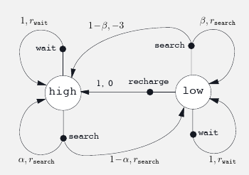

# Chapter 3
# Finite Markov Decision

- Markov Decision Process = MDP
- Instead of looking at action and reward, we also look at action and reward in a specific situation
- Intead of $q_*(a)$ we look at $q_*(s,a)$ where $s$ is a specific state
  - Or estimate $v_*(s)$, value of each state given optimal action selections

## The Agent-Environment Interface

- 
- The agent is the thing that makes the action and the environment is everything outside of that and gives the agent rewards as well as new sttes
- The agent of course wants to maximize its reward
- Time steps are discrete i.e. $t = 0, 1, 2, 3, ...$
- For each $t$ the agent receives a *state* $S_t \in \mathcal{S}$
- Based on $S_t$, the agent selects an *action* $A_t \in \mathcal{A}(s)$ 
- 1 time step later receives a *reward*  $R_{t+1} \in \mathcal{R} \subset \mathbb{R}$, then finds a new state $S_{t+1}$
- To put the above together, the sequence of state, action reward is as follows:
  - $S_0, A_0, R_1, S_1, A_1, R_2, \dots$
- For *finite* MDP, $\mathcal{S}, \mathcal{A}, \mathcal{R}$ have a finite number of elements
- Probability of a state $s'$ and a reward $r$ given a previous state and action is a discrete probability
  - $p(s', r|s, a) = Pr\{S_t = s', R_t = r| S_{t-1}=s, A_{t-1} = a\}$
  - $p: \mathcal{S} \times \mathcal{R} \times \mathcal{S} \times \mathcal{A} \rightarrow [0,1]$
  - Since $p(s', r|s, a)$ is a probability distribution:
    - $\sum\limits_{s'\in\mathcal{S}}\sum\limits_{r\in\mathcal{R}}p(s', r|s, a) = 1$
- *state-transition probabilities*:  $p(s'|s,a) := Pr\{S_t = s'|S_{t-1}=s, A_{t-1}  = a\} = \sum\limits_{r\in\mathcal{R}}p(s',r|s,a)$
- *Expected reward for State-Action pairs*: $r(s,a) := E[R_t|S_{t-1}=s, A_{t-1}=a] = \sum\limits_{r\in\mathcal{R}}r\sum\limits_{s'\in\mathcal{S}}p(s',r|s,a)$
- *Expected reward for state-action-next-state*: $r(s,a,s') := E[R_t|S_{t-1}=s, A_{t-1}=a, S_t=s'] = \sum\limits_{r\in\mathcal{R}}r\dfrac{p(s',r|s,a)}{p(s'|s,a)}$
- Anything outside the agent is the environment
  - for example if the agent was a robot, everything including the world, its arms and motors are considered the environment whereas the agent is just what makes decisions such as amount of voltage goes to the motor, or for how long the motor must run, but the agent gets in information such as what is in the world (via motion sensors, or camera).
- *Exercise 3.1* Devise three example tasks of your own that fit into the MDP framework, identifying for each its states, actions, and rewards. Make the three examples as different from each other as possible. The framework is abstract and flexible and can be applied in many different ways. Stretch its limits in some way in at least one of your examples.
    -  Task 1: Chopping tings at STC
       -  Actions would be everything from pick up lines, flirtatious touching, teasing, smiling etc., States would be responses from the tings at STC, weather they are smiling, returning physical contact etc, and then finally the reward would be number of phone numbers
    - Task 2: Boxing
      - Actions would be punches, foot work (i.e. moving back, front, left, right), head movement (same as footwork but with your head and in 3 dimensions), and blocking, the state would be distance from opponent, place in ring (i.e. near the ropes, close to the center etc.), distance of opponents face from your fist (and vice versa), distance of opponents body from fist (and vice versa), your current stance (are you shelled up, are hands down, etc.),  opponents stance, opponents body type and fighting style could also be part of the state. Reward would be number of punches landed
    - Task 3: Online shopping
      - Actions would be making purchases, searching for coupon codes, searching for alternative websites, searching for bundled versions of what you are looking for, or maybe even bulk versions, state would be what is currently available (such as current price and stock), search results, what the time of day is, where the website is located (i.e. a website with .ca is ideal if you live in canada) and more, and reward would be the amount of money saved from the average price of the item bought.
- *Exercise 3.2* Is the MDP framework adequate to usefully represent all goal-directed learning tasks? Can you think of any clear exceptions?
  - An exception would of course be cases where the state is not clearly measuerable, for example, my task one for exercise 3.1 can't easily be used in a MDP deployment since things like how a person is feeling or reacting to my shitty pick up lines is not measureable (although one can assume its always negative 😿). 
- *Exercise 3.3* Consider the problem of driving. You could define the actions in terms of the accelerator, steering wheel, and brake, that is, where your body meets the machine. Or you could define them farther out—say, where the rubber meets the road, considering your actions to be tire torques. Or you could define them farther in—say, where your brain meets your body, the actions being muscle twitches to control your limbs. Or you could go to a really high level and say that your actions are your choices of where to drive. What is the right level, the right place to draw the line between agent and environment? On what basis is one location of the line to be preferred over another? Is there any fundamental reason for preferring one location over another, or is it a free choice?
  - Of course things like computation power as well as accuracy required will play a big role in where to draw the line. The high level of where to drive might be useful, but far too inaccurate if we wanted to create something like autopilot. However, things like where our brain sends signals to move our limbs to control the car might be computationally expensive, but might be required for a specific problem. Thus the simple answer is, it depends on what we are trying to solve and what is needed to solve it.
- Example 3.3: recycling robot. Suppose there is a robot with the following constraints:
  - Battery state can be either low or high (binary)
  - The robot can actively search for cans, or wait for someone to drop cans into its bin
  - While searching with battery state in high, the robots battery remains at high with a probability of $\alpha$
    - thus goes to low with a probability of $1-\alpha$
  - While searching with battery state in low, the robots battery remains low with a probability of $\beta$
    - thus depletes with a probability of $1-\beta$
  - The robot can decide to go to its charging station if its battery is low
  - Reward if battery is depleted is -3
  - Reward for cans picked up while searching is $r_{search}$
  - Reward for cans picked up while waiting is $r_{wait}$
  - There is no reward for recharging
  - One can descriobe the dynamics with the following figure:
    - 
  - One can also describe the dynamics with the following table:
  
| $s$ | $a$ | $s'$ | $p(s':s,a)$ | $r(s,a,s')$ |
| --- | --- | ---- | ----------- | ---------- |
| high | search | high | $\alpha$ | $r_{search}$ |
| high | search | low | $1 - \alpha$ | $r_{search}$ |
| low | search | high | $1 - \beta$ | $-3$ |
| low | search | low | $\beta$ | $r_{search}$ |
| high | wait | high | $1$ | $r_{wait}$ |
| high | wait | low | $0$ |  |
| low | wait | high | $0$ |  |
| low | wait | low | $1$ | $r_{wait}$ |
| low | recharge | high | $1$ | $0$ |
| low | recharge | low | $0$ |  |

- *Excercise 3.4* Give a table analogous to that in example 3.3, but for $p(s',r|s,a)$. It should have columns for $s, a, s', r$ and $p(s',r|s,a)$ and a row for every 4-tuple for which $p(s',r|s,a) > 0$
  - $p(s', r|s, a) = Pr\{S_t = s', R_t = r| S_{t-1}=s, A_{t-1} = a\}$
  - The table remains essentially the same because the reward is determined by the current state, and if we see the table, the probability that we have a reward $r_{search}$ depends on weather the current state $s'$ has gone from either high to low, high to high, or low to low, thus making the end result the same as $p(s'|s,a)$ (I thought this was wrong when I came up with it, but many others had the same solution, so I think I am still right).
  
| $s$ | $a$ | $s'$ | $r$ | $p(s', r:s,a)$ |
| --- | --- | ---- | ----------- | ---------- |
| high | search | high | $r_{search}$  |  $\alpha$ |
| high | search | low | $r_{search}$  |  $1 - \alpha$ |
| low | search | high |  $-3$  | $1 - \beta$ |
| low | search | low | $r_{search}$  | $\beta$ |
| high | wait | high | $r_{wait}$  | $1$ |
| high | wait | low | $0$ |  |
| low | wait | high | $0$ |  |
| low | wait | low | $r_{wait}$  | $1$ |
| low | recharge | high |  $0$  | $1$ |
| low | recharge | low | $0$ |  |

## Goals and Rewards

- *Reward Hypothesis*: All of what we mean by goals and purposes can be well thought of as the maximization of the expected value of the cumulative sum of a received scalar signal (called reward)
- One must be careful with how rewards are set because you may see some undesired results
  - For example, if you made a chess bot and rewarded it for taking pieces, then the machine might maximize reward by taking pieces, but ultimately losing the game
- Rewards tell the machine what you want it to achieve, and not how you want them to achieve it

## Returns and Episodes

- Expected reward, denoted as $G_t$ is a function on some arbitrary part of the reward series, for example if looking at rewards from time step t onwards, $G_t$ will be applied on $R_{t}, R_{t+1}, R_{t+3} \dots$
  - Simplest case is $G_t = R_{t} + R_{t+1} + \dots + R_{T}$
    - $T$ is the final time step
- *Episodes*: Subsequences of of an agent-environment interaction (sometimes called trials)
  - Examples include: plays of a game, trips through a maze or any repeated interaction
- *Terminal State*: The state in which an episode ends in
  - after the terminal state, machine is reset to a starting state
- Episodes are run independant of each other (i.e. the current episode does not depend on weather the last one resulted in a win or lose)
- *Episodic Tasks*: Tasks that have independant episodes with terminal states
  - Set of all non-terminal states is denoted $\mathcal{S}$
  - Set of all non-terminal states, plus terminal states is denoted $\mathcal{S}^+$
  - Time of termination is a random variable denoted as $T$
- *Continuing Tasks*: Tasts that do not break into episodes, and goes on forever
  - E.g. used to formulate on-going process-control or a robot with a long life span
  - Since $T = \infty$, reward would also be $\infty$, this is where *discounting* comes in
- *discounting*: an approach for calculating rewards where the agent picks the action that maximizes the sum of discounted rewards
  - i.e. chooses $A_t$ to maximize *discounted return*:
    - $G_t := R_{t+1} + \gamma R_{t+2} + \gamma^2 R_{t+3} + \dots = \sum\limits_{k=0}^{\infty}\gamma^kR_{t+k+1}$
    - $\gamma \in [0,1]$ and is called the *discounted rate*
    - **If $\gamma < 1$, and reward sequence $\{R_k\}$ is bounded, then the sum converges** (might be a fun result to prove later so I'm going to bold it)
    - If $\gamma = 0$, then the agent is *myopic* and only cares about maximizing $R_{t+1}$ (i.e. does not worry about the future)
      - *fun fact*: I call it *Oogway-ish* because of the goated kung-fu panda quote "Yesterday is history, Tomorrow is a mystery, but today is a gift, that's why they call it the present" 
    - and of course as $\gamma$ gets closer to one, ~~it becomes like my mom and worres about my future and what I am going to do with my life~~, it counts future rewards more strongly
- $G_t = R_{t+1} + \gamma R_{t+2} + \gamma^2R_{t+3} + \dots = R_{t+1} + \gamma G_{t+1}$
- If reward is a constant $+1$ then return is:
  - $G_t = \sum\limits_{k=0}^{\infty}\gamma^k = \dfrac{1}{1-\gamma}$
- *Exercise 3.5*  The equations in Section 3.1 are for the continuing case and need to be modified (very slightly) to apply to episodic tasks. Show that you know the modifications needed by giving the modified version of (3.3).
  - Since we are now looking at "terminal" tasks seperately, we must change $s \in \mathcal{S}$ to $s \in \mathcal{S}^+$
  - Thus we go from $\sum\limits_{s'\in\mathcal{S}}\sum\limits_{r\in\mathcal{R}}p(s', r|s, a) = 1$
  - to $\sum\limits_{s'\in\mathcal{S}^+}\sum\limits_{r\in\mathcal{R}}p(s', r|s, a) = 1$
- *Exercise 3.6* Suppose you treated pole-balancing as an episodic task but also used discounting, with all rewards zero except for 1 upon failure. What then would the return be at each time? How does this return di↵er from that in the discounted, continuing formulation of this task?
  - $G_t = R_{t+1} + \gamma R_{t+2} + \gamma^2 R_{t+3} + \dots + \gamma^{T-t-1} R_{T}$
  - $G_t = (0) + \gamma (0) + \gamma^2 (0) + \dots + \gamma^{T-t-1} (-1)$ Since the reward is 0 all the way until failiure at terminal step $T$
  - $G_t = -\gamma^{T-t-1}$
- *Exercise 3.7*  Imagine that you are designing a robot to run a maze. You decide to give it a reward of +1 for escaping from the maze and a reward of zero at all other times. The task seems to break down naturally into episodes—the successive runs through the maze—so you decide to treat it as an episodic task, where the goal is to maximize expected total reward (3.7). After running the learning agent for a while, you find that it is showing no improvement in escaping from the maze. What is going wrong? Have you effectively communicated to the agent what  you want it to achieve?
  - The reward does not improve since we are looking at the tasks episodically, thus each episode's reward is not related to the others, thus the reward will stay one as every episode terminates.
  - Thus nothing is really going wrong, as the agent is indeed escaping the maze, however, if I want it to increase in speed, the reward calculation must be redesigned, for example having the reward be -1 for each second it remains in the maze or something.
- *Exercise 3.8*  Suppose $\gamma = 0.5$ and the following sequence of rewards is received $R_1 = -1, R_2 = 2, R_3 = 6, R_4 = 3, and R_5 = 2$, with $T = 5$. What are $G_0 , G_1 , . . ., G_5$ ? Hint: Work backwards.
  - I am guessing since we are working backwards we are using $G_t = R_{t+1} + \gamma G_{t+1}$
  - Since there is no $R_6$, $G_5 = 0$
  - $G_4 = R_5 + 0 = 2$
  - $G_3 = R_4 + \gamma G_4 = 3 + 1 = 4$
  - $G_2 = R_3 + \gamma G_3 = 6 + 2 = 8$
  - $G_1 = R_2 + \gamma G_2 = 2 + 8 = 10$
  - $G_0 = R_1 + \gamma G_1 = -1 + 10 = 9$ 
- *Exercise 3.9*  Suppose $\gamma= 0.9$ and the reward sequence is $R_1 = 2$ followed by an infinite sequence of 7s. What are $G_1$ and $G_0$ ?
  - $G_1 = \sum\limits_{k=0}^\infty \gamma^k R_{t + k + 1} = \sum\limits_{k=0}^\infty 7\gamma^k = 7 \lim_{k \to \infty}\left(\dfrac{1 - 0.9^{k+1}}{1 - 0.9}\right) = 7(10) = 70$
  - $G_0 = R_1 + \gamma G_1 = 2 + (0.9)(70) = 65$
- *Exercise 3.10* Prove the second equality in (3.10)
  - Want to prove that $\sum_{k=0}^\infty \gamma^k = \dfrac{1}{1-\gamma}$
  - $\sum_{k=0}^\infty \gamma^k$ is a geometric sum, which means the final formula is:
    - $\lim_{k \to \infty}\left(\dfrac{1 - \gamma^{k+1}}{1 - \gamma}\right)$
  - Since $\gamma \in (0,1)$, $\lim_{k \to \infty} \gamma^{k+1} = 0$
  - Thus we are left with:
    - $\lim_{k \to \infty}\left(\dfrac{1 - \gamma^{k+1}}{1 - \gamma}\right) = \dfrac{1}{1 - \gamma}$ as wanted

