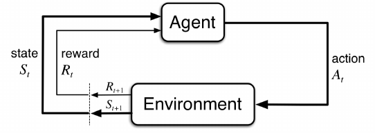

# Chapter 3
# Finite Markov Decision

- Markov Decision Process = MDP
- Instead of looking at action and reward, we also look at action and reward in a specific situation
- Intead of $q_*(a)$ we look at $q_*(s,a)$ where $s$ is a specific state
  - Or estimate $v_*(s)$, value of each state given optimal action selections

## The Agent-Environment Interface

- 
- The agent is the thing that makes the action and the environment is everything outside of that and gives the agent rewards as well as new sttes
- The agent of course wants to maximize its reward
- Time steps are discrete i.e. $t = 0, 1, 2, 3, ...$
- For each $t$ the agent receives a *state* $S_t \in \mathcal{S}$
- Based on $S_t$, the agent selects an *action* $A_t \in \mathcal{A}(s)$ 
- 1 time step later receives a *reward*  $R_{t+1} \in \mathcal{R} \subset \mathbb{R}$, then finds a new state $S_{t+1}$
- To put the above together, the sequence of state, action reward is as follows:
  - $S_0, A_0, R_1, S_1, A_1, R_2, \dots$
- For *finite* MDP, $\mathcal{S}, \mathcal{A}, \mathcal{R}$ have a finite number of elements
- Probability of a state $s'$ and a reward $r$ given a previous state and action is a discrete probability
  - $p(s', r|s, a) = Pr\{S_t = s', R_t = r| S_{t-1}=s, A_{t-1} = a\}$
  - $p: \mathcal{S} \times \mathcal{R} \times \mathcal{S} \times \mathcal{A} \rightarrow [0,1]$
  - Since $p(s', r|s, a)$ is a probability distribution:
    - $\sum\limits_{s'\in\mathcal{S}}\sum\limits_{r\in\mathcal{R}}p(s', r|s, a) = 1$
- *state-transition probabilities*:  $p(s'|s,a) := Pr\{S_t = s'|S_{t-1}=s, A_{t-1}  = a\} = \sum\limits_{r\in\mathcal{R}}p(s',r|s,a)$
- *Expected reward for State-Action pairs*: $r(s,a) := E[R_t|S_{t-1}=s, A_{t-1}=a] = \sum\limits_{r\in\mathcal{R}}r\sum\limits_{s'\in\mathcal{S}}p(s',r|s,a)$
- *Expected reward for state-action-next-state*: $r(s,a,s') := E[R_t|S_{t-1}=s, A_{t-1}=a, S_t=s'] = \sum\limits_{r\in\mathcal{R}}r\dfrac{p(s',r|s,a)}{p(s'|s,a)}$
- Anything outside the agent is the environment
  - for example if the agent was a robot, everything including the world, its arms and motors are considered the environment whereas the agent is just what makes decisions such as amount of voltage goes to the motor, or for how long the motor must run, but the agent gets in information such as what is in the world (via motion sensors, or camera).
- *Exercise 3.1* Devise three example tasks of your own that fit into the MDP framework, identifying for each its states, actions, and rewards. Make the three examples as different from each other as possible. The framework is abstract and flexible and can be applied in many different ways. Stretch its limits in some way in at least one of your examples.
    -  Task 1: Chopping tings at STC
       -  Actions would be everything from pick up lines, flirtatious touching, teasing, smiling etc., States would be responses from the tings at STC, weather they are smiling, returning physical contact etc, and then finally the reward would be number of phone numbers
    - Task 2: Boxing
      - Actions would be punches, foot work (i.e. moving back, front, left, right), head movement (same as footwork but with your head and in 3 dimensions), and blocking, the state would be distance from opponent, place in ring (i.e. near the ropes, close to the center etc.), distance of opponents face from your fist (and vice versa), distance of opponents body from fist (and vice versa), your current stance (are you shelled up, are hands down, etc.),  opponents stance, opponents body type and fighting style could also be part of the state. Reward would be number of punches landed
    - Task 3: Online shopping
      - Actions would be making purchases, searching for coupon codes, searching for alternative websites, searching for bundled versions of what you are looking for, or maybe even bulk versions, state would be what is currently available (such as current price and stock), search results, what the time of day is, where the website is located (i.e. a website with .ca is ideal if you live in canada) and more, and reward would be the amount of money saved from the average price of the item bought.
- *Exercise 3.2* Is the MDP framework adequate to usefully represent all goal-directed learning tasks? Can you think of any clear exceptions?
  - An exception would of course be cases where the state is not clearly measuerable, for example, my task one for exercise 3.1 can't easily be used in a MDP deployment since things like how a person is feeling or reacting to my shitty pick up lines is not measureable (although one can assume its always negative 😿). 
- *Exercise 3.3* Consider the problem of driving. You could define the actions in terms of the accelerator, steering wheel, and brake, that is, where your body meets the machine. Or you could define them farther out—say, where the rubber meets the road, considering your actions to be tire torques. Or you could define them farther in—say, where your brain meets your body, the actions being muscle twitches to control your limbs. Or you could go to a really high level and say that your actions are your choices of where to drive. What is the right level, the right place to draw the line between agent and environment? On what basis is one location of the line to be preferred over another? Is there any fundamental reason for preferring one location over another, or is it a free choice?
  - Of course things like computation power as well as accuracy required will play a big role in where to draw the line. The high level of where to drive might be useful, but far too inaccurate if we wanted to create something like autopilot. However, things like where our brain sends signals to move our limbs to control the car might be computationally expensive, but might be required for a specific problem. Thus the simple answer is, it depends on what we are trying to solve and what is needed to solve it.

 